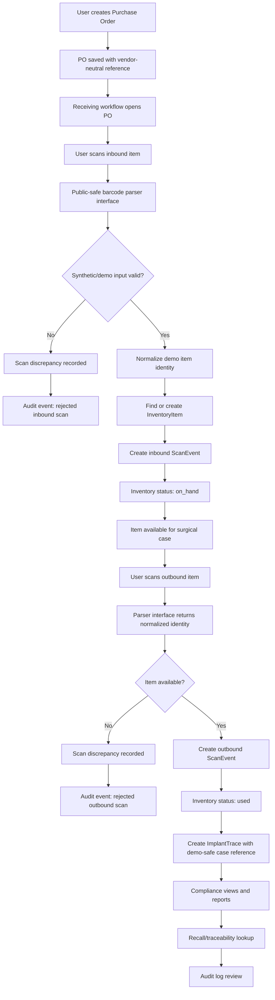
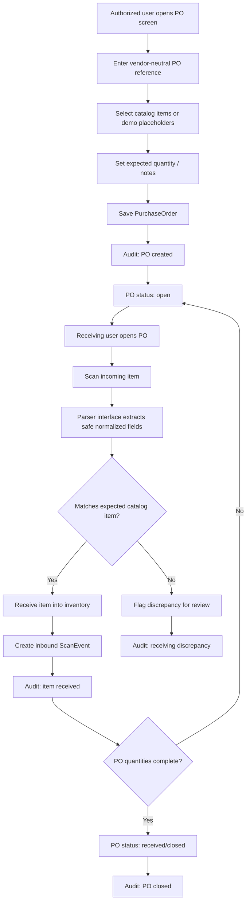
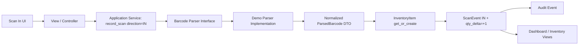
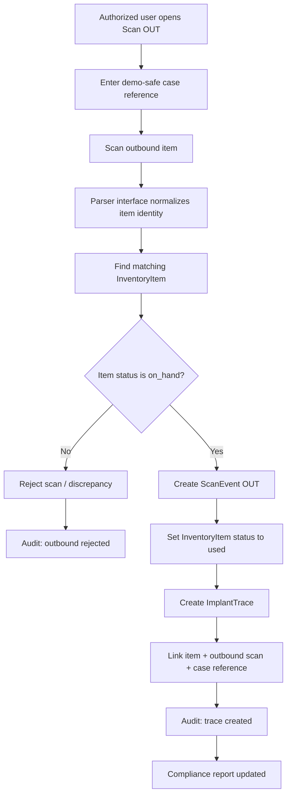
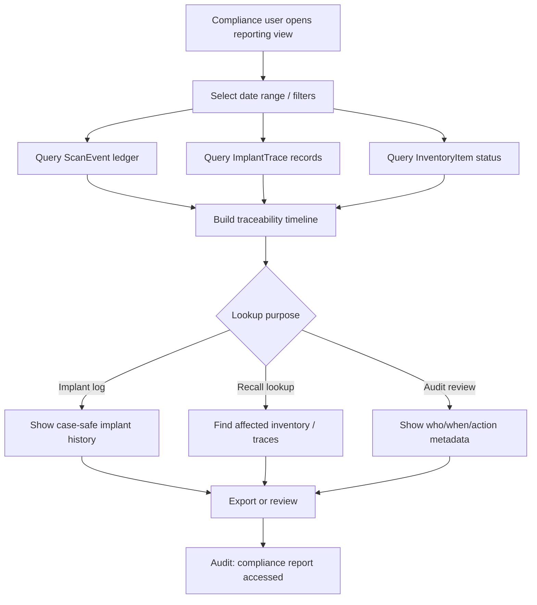
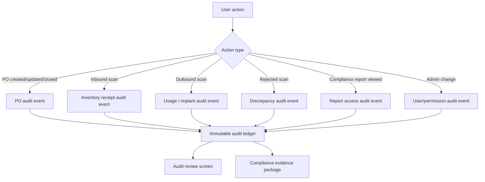
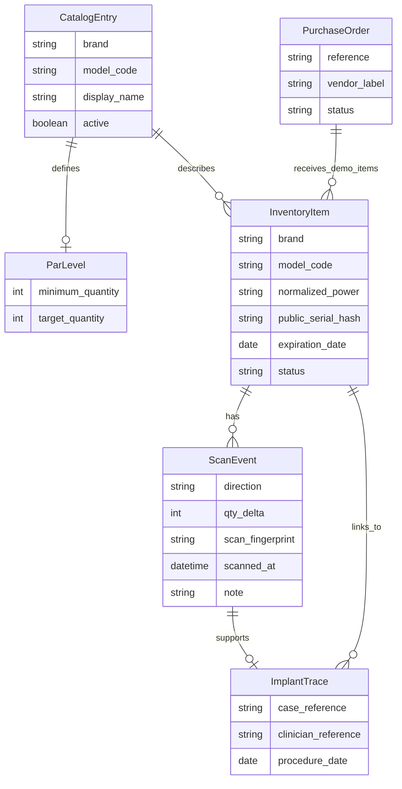
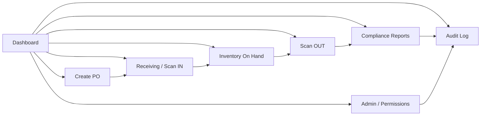

# Surgical Ledger — Public Architecture Demo

This repository is a sanitized Django demo that shows the architecture of a surgical inventory and traceability system without exposing proprietary parsing logic, catalog data, production workflows, patient data, logs, database files, or Git history.

## What this demo shows

- Layered Django app structure
- Public-safe scan IN / scan OUT flow
- Parser interface and dispatcher boundary
- Immutable scan ledger concept
- Traceability record concept
- Catalog, par-level, and purchase-order model boundaries
- Compliance summary boundary

## What is intentionally omitted

- Vendor-specific barcode parsing logic
- Production catalog mappings
- Real identifiers, MRNs, clinician names, chart links, serials, and scan examples
- Operational exception handling specific to the private deployment
- Real migrations and seeded data
- Logs, local databases, private settings, and Git history

## Local demo

```bash
python -m venv .venv
source .venv/bin/activate
pip install -r requirements.txt
python manage.py makemigrations inventory
python manage.py migrate
python manage.py runserver
```

Demo barcode format:

```text
DEMO:DEMO_A:MODEL1:+20.0:SERIAL123
```

This synthetic format is deliberately unrelated to production barcode formats.

## Architecture map

```text
inventory/
  models.py                  Public-safe domain model boundaries
  services.py                Parser interface + synthetic demo parser
  application/
    scan_common.py           Shared scan orchestration
    scan_in.py               Inbound scan use case
    scan_out.py              Outbound scan + traceability use case
    compliance.py            Reporting boundary
  domain/
    exceptions.py            Domain error types
    audit.py                 Audit helper boundary
    normalization.py         Generic normalization helper
```

## Lifecycle flowcharts
# Surgical Ledger Public Architecture: Full Lifecycle Flowcharts

This document illustrates the public-safe lifecycle of the application from purchase order creation through receiving, inventory availability, implant usage, traceability, compliance review, and audit logging.

Proprietary barcode parsing logic, vendor-specific catalog rules, real patient identifiers, real clinician identifiers, real chart references, and private workflow decisions are intentionally omitted or generalized.

---

## 1. End-to-End Lifecycle Overview



---

## 2. Purchase Order to Receiving Flow



Public-safe implementation note: the demo repository should show the PO lifecycle and interfaces, but should not expose real vendor matching rules, real catalog data, vendor-specific ordering patterns, or private receiving exceptions.

---

## 3. Inbound Scan Architecture



Inbound data handling rules:

- Raw barcode content is not persisted in the public-safe version.
- Serial identity is represented by a fingerprint/hash placeholder.
- Brand/model/power are represented with generic normalized values.
- Parser internals remain omitted.

---

## 4. Outbound Surgical Use / Implant Trace Flow



Traceability handling rules:

- Use demo-safe case references, not MRNs.
- Use clinician references or roles, not real names.
- Use generic procedure dates where needed.
- Avoid exposing private chart-linking logic.

---

## 5. Compliance, Recall, and Traceability Lookup



Public-safe implementation note: the public repository should demonstrate report composition and data relationships, not real recall rules, real patient lookup behavior, or proprietary report formatting.

---

## 6. Audit Logging Map



Recommended public-safe audit event fields:

| Field | Public-safe purpose |
|---|---|
| event_type | Generic action category |
| actor_reference | Non-sensitive user reference or role |
| object_type | Entity category, such as PO, item, scan, trace |
| object_reference | Demo-safe ID or fingerprint |
| timestamp | When the action occurred |
| result | Success, rejected, discrepancy, reviewed |
| note | Non-sensitive explanation |

Do not include raw barcodes, MRNs, chart URLs, patient names, clinician names, real account emails, real vendor IDs, or proprietary rule outputs.

---

## 7. Data Entity Relationship Map



---

## 8. Suggested Demo Repository Screens / Modules



Demo-safe screens should use synthetic values only:

- `DEMO:ACME:MODEL-100:+20.0:SERIAL-001`
- `CASE-DEMO-0001`
- `CLINICIAN-ROLE-DEMO`
- `PO-DEMO-0001`

---

## 9. Full Lifecycle Acceptance Criteria

A public/interview-safe demo should be able to show this lifecycle:

1. User creates a demo PO.
2. User receives a synthetic item against the PO.
3. App creates or updates inventory using a placeholder parser interface.
4. App records an inbound scan event.
5. Dashboard shows item as available.
6. User scans the item out to a demo-safe case reference.
7. App records outbound scan event.
8. App creates implant trace link.
9. Compliance report shows item movement and traceability.
10. Audit log shows all major actions without sensitive data.

This demonstrates the app architecture without disclosing proprietary parsing logic, real clinical workflows, or confidential operational data.

# Sanitization Notes

The source archive contained private-risk material that should not be published directly. This public package was rebuilt as a separate architecture demo.

Removed or not copied:

- `.git/` and all historical objects
- SQLite database
- logs
- bytecode caches
- original migrations with seeded operational/catalog data
- proprietary barcode parsing implementation
- production views/templates exposing workflow details
- patient/case/clinician-style example data

Retained conceptually:

- Django project shape
- inventory app boundary
- scan service boundary
- inbound/outbound workflow boundary
- immutable event ledger concept
- implant traceability concept
- compliance reporting boundary
- catalog/par/purchase-order model boundaries


See `docs/FULL_LIFECYCLE_FLOWCHARTS.md` for public-safe flowcharts covering purchase order creation, receiving, scan in, scan out, implant traceability, compliance reporting, recall lookup, and audit logging.
